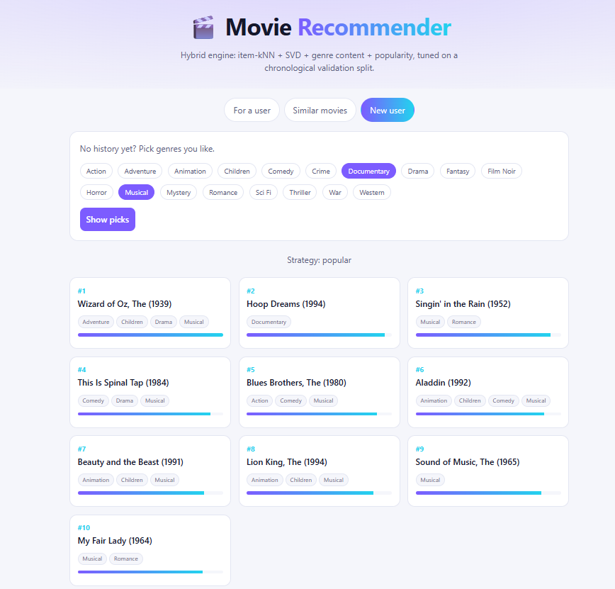
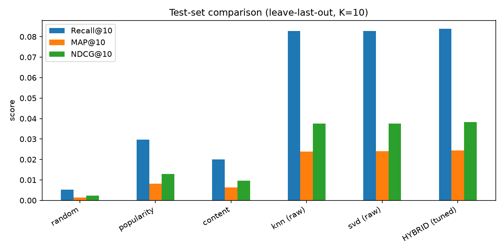

<div align="center">

# 🎬 Movie Recommender

**A hybrid recommendation engine on MovieLens 100K, served by FastAPI and Docker.**
It recommends about **3× more relevant movies than a popularity baseline** and explains every pick.

[](https://github.com/johnthuo-analytics/movie-recommender/actions)




</div>

## Quick start

```bash
pip install -r requirements.txt
python evaluate.py      # compare models, tune weights (downloads the data)
python train.py         # train on all data, save the artifact
uvicorn api:app         # open http://127.0.0.1:8000
```

## Highlights

- **Honest evaluation:** chronological leave-last-out with separate validation and test items; nothing is tuned on the test set.
- **Four signals blended:** item-kNN, SVD, genre content and popularity, with weights chosen on validation data.
- **Explainable:** each recommendation returns per-component scores, shown in the demo as "Why".
- **Cold start:** new users get popularity boosted by their chosen genres.
- **Production habits:** training separate from serving, 43 tests, ruff, GitHub Actions CI, Docker.



## 1. Problem
Given a user's rating history, suggest movies they have not seen yet and are
likely to watch next. New users with no history still get sensible suggestions.

## 2. Dataset
[MovieLens 100K](https://grouplens.org/datasets/movielens/100k/): 100,000 ratings
(1-5) from 943 users on 1,682 movies, plus 19 genre flags per movie.
`python train.py` and `python evaluate.py` download it automatically into `data/`.

## 3. Architecture
```text
data.py -> preprocessing.py -> content_model.py ┐
                               collaborative_model.py ├-> ranking.py (hybrid blend)
                               ranking.py (popularity) ┘         |
                                                          inference.py (Recommender)
                                                                 |
train.py -> artifacts/recommender.joblib -> api.py (FastAPI) -> Docker
evaluate.py -> reports/*.csv, model_comparison.png, best_config.json
```
Training and serving are separate: the API only loads a saved artifact.

## 4. Algorithms
| Component | Idea |
|---|---|
| Popularity | IMDB-style weighted rating; shrinks small-sample averages toward the global mean |
| Content | Cosine similarity of binary genre vectors; user score = mean similarity to liked movies |
| Item-kNN | Cosine between item columns, shrunk by co-rater count, top-50 neighbours. Rating signal (`raw`, `binary`, `centered`) chosen on validation data |
| SVD | Truncated SVD (PureSVD) with fold-in for any user history |
| Hybrid | Per-user min-max normalised scores blended with weights tuned on validation data |
| Cold start | Popularity, boosted by optional preferred genres |

## 5. Evaluation
Chronological **leave-last-out**: each user's latest rating is the test item, the
second-latest is validation. Every unseen movie is ranked and we record where the
held-out movie lands. Metrics: Precision@K, Recall@K, MAP@K, NDCG@K, MRR, plus
coverage, popularity bias and diversity. Model variants and hybrid weights are
chosen on validation; the test item is scored once. Because there is one relevant
item per user, Recall@K equals HitRate@K and Precision@K equals Recall@K / K.

Results below come from `python evaluate.py` (full numbers in `reports/test_results.csv`). Test set: one held-out item per eligible user, i.e. users with at least 5 ratings.

| Model | Recall@10 (= HitRate) | MAP@10 | NDCG@10 | MRR | Coverage@10 |
|---|---|---|---|---|---|
| Random | 0.0053 | 0.0015 | 0.0024 | 0.0046 | 0.9958 |
| Popularity | 0.0297 | 0.0082 | 0.0130 | 0.0134 | 0.0059 |
| Content (genres) | 0.0201 | 0.0064 | 0.0097 | 0.0104 | 0.4566 |
| Item-kNN | 0.0827 | 0.0239 | 0.0375 | 0.0364 | 0.1950 |
| SVD | 0.0827 | 0.0240 | 0.0375 | 0.0372 | 0.1350 |
| **Hybrid (tuned)** | **0.0838** | **0.0245** | **0.0382** | **0.0378** | 0.2812 |

Tuned hybrid weights (chosen on validation data): SVD 0.9, content 0.1, kNN 0.0, popularity 0.0.

**Reading the results:** every personalised model beats the popularity baseline by roughly 3x on Recall@10. The hybrid is the best model on every ranking metric, but its edge over plain SVD is tiny. With only one test item per user, a gap that small is probably noise. The weight tuning mostly selected SVD, with content similarity as a small tie-breaker. Popularity has very low coverage (0.6% of the catalogue) because it recommends the same few movies to everyone.

## 6. API
| Endpoint | Purpose |
|---|---|
| `GET /` | interactive demo page |
| `GET /genres` | valid genre names |
| `GET /health` | service, version and model status |
| `GET /recommendations/user/{user_id}?k=10&preferred_genres=Drama` | personalised (hybrid), or cold start for unknown users |
| `GET /recommendations/movie/{movie_id}?k=10&mode=content\|collaborative` | similar movies; 404 if unknown |
| `GET /recommendations/popular?k=10&preferred_genres=Comedy` | popularity ranking |

Interactive demo: `http://localhost:8000/` · API docs: `http://localhost:8000/docs`.

## 7. Run locally
```bash
python -m venv .venv
source .venv/bin/activate        # Windows: .venv\Scripts\activate
pip install -r requirements.txt
pytest -q                        # run the tests
python evaluate.py               # compare models, tune weights, write reports/
python train.py                  # train on all data, save artifacts/
uvicorn api:app --reload         # demo at http://127.0.0.1:8000  (docs at /docs)
```
Docker (after `python train.py`):
```bash
docker build -t movie-recommender .
docker run -p 8000:8000 movie-recommender
```

## 8. Limitations
- MovieLens 100K is a classroom benchmark, not live traffic; offline metrics do not guarantee online performance.
- One held-out item per user gives noisy metrics; differences between close models may not be meaningful.
- Genre-only content features are coarse: many movies share identical genre vectors.
- Dense similarity matrices suit ~1.7k movies; larger catalogues need approximate nearest neighbours.
- New movies with no ratings only get content-based scores.
- The artifact is a pickle: load only files you trained, with the same library versions.

## 9. Future improvements
Authentication and rate limiting, model versioning, monitoring and drift checks, diversity re-ranking, richer content features (TMDB metadata), implicit-feedback models (ALS/BPR), experiment tracking and scheduled retraining.
