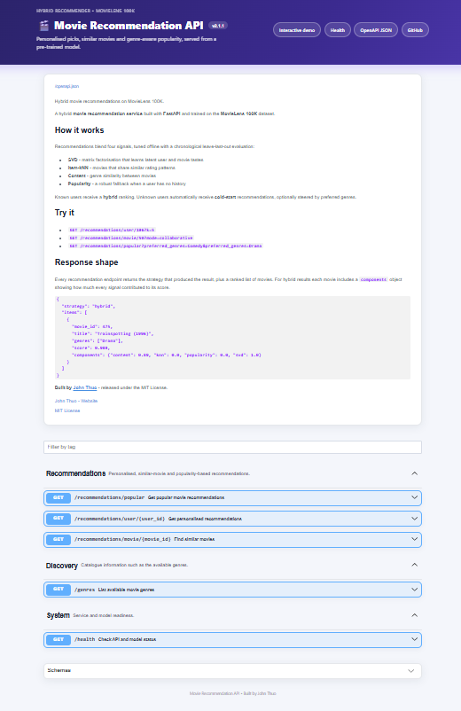

"""FastAPI service for the Movie Recommendation System."""

from **future** import annotations

import os
from contextlib import asynccontextmanager
from pathlib import Path
from typing import Literal

from fastapi import FastAPI, HTTPException, Query, Request
from fastapi.middleware.cors import CORSMiddleware
from fastapi.openapi.docs import get_swagger_ui_html
from pydantic import BaseModel

from recommender.config import ARTIFACT_PATH, DEFAULT_K, GENRE_COLS, MAX_K
from recommender.exceptions import UnknownMovieError
from recommender.inference import Recommender

VERSION = "2.1.1"

BASE_DIR = Path(**file**).resolve().parent
INDEX_HTML = BASE_DIR / "static" / "index.html"

DESCRIPTION = """
# 🎬 Movie Recommendation API

**A hybrid movie recommendation service built with FastAPI and trained on the MovieLens 100K dataset. It combines item-kNN, SVD, content similarity and popularity signals.**

[](https://github.com/johnthuo-analytics/movie-recommender/actions/workflows/ci.yml)


## 🌐 Live Demo

**https://movie-recommender-03sk.onrender.com** · [API docs](https://movie-recommender-03sk.onrender.com/docs)

> Hosted on a free plan: after 15 minutes idle it sleeps, and the first load can take about 50 seconds.


## Features

* 🎯 Personalised recommendations for users
* 🎬 Similar movie recommendations
* 🔥 Popular movie recommendations
* 🎭 Genre-based preferences
* 🩺 API and model health checks
* 🌐 Interactive movie recommendation demo

## Recommendation methods

**Collaborative filtering** uses user-movie interaction patterns to identify
movies that may be relevant to users with similar preferences.

**SVD** uses matrix factorisation to learn relationships between users and
movies.

**Item similarity** identifies movies with similar interaction patterns.

**Content similarity** compares movies using their genres.

**Popularity** provides recommendations when limited user history is available.

For known users, the system can combine multiple signals into a hybrid
recommendation. Users without sufficient history can receive popular
recommendations instead.

## Endpoints

### Personalised recommendations

`GET /recommendations/user/{user_id}`

Returns recommendations for a MovieLens user.

### Similar movies

`GET /recommendations/movie/{movie_id}`

Returns movies similar to a selected movie.

Available modes:

* `content` — genre-based similarity
* `collaborative` — interaction-based similarity

### Popular movies

`GET /recommendations/popular`

Returns popular movies with optional genre preferences.

### Genres

`GET /genres`

Returns the genres available to the recommendation system.

### Health

`GET /health`

Returns the current API and model status.

## Interactive demo

**[Open the Movie Recommender](/)**

## Example response

```json
{
  "strategy": "hybrid",
  "items": [
    {
      "movie_id": 475,
      "title": "Trainspotting (1996)",
      "genres": ["Drama"],
      "score": 0.989,
      "components": {
        "content": 0.89,
        "knn": 0.0,
        "popularity": 0.0,
        "svd": 1.0
      }
    }
  ]
}
```

## Technology

**Python • FastAPI • Pandas • NumPy • Scikit-learn • Joblib • MovieLens 100K**

Built by **John Thuo**.

**GitHub:** https://github.com/johnthuo-analytics

**License:** MIT
"""
   ## 🌐 Live Demo

   **https://movie-recommender-03sk.onrender.com** · [API docs](https://movie-recommender-03sk.onrender.com/docs)

   > Hosted on a free plan: after 15 minutes idle it sleeps, and the first load can take about 50 seconds.

   

DOCS_CSS = """

<style>
body {
    background: #f5f7fb !important;
}

.swagger-ui {
    max-width: 1180px;
    margin: 0 auto;
    padding: 0 18px 40px;
    font-family:
        Inter,
        -apple-system,
        BlinkMacSystemFont,
        "Segoe UI",
        Roboto,
        Helvetica,
        Arial,
        sans-serif;
}

.swagger-ui .topbar {
    background: linear-gradient(
        135deg,
        #111827 0%,
        #1f2937 55%,
        #374151 100%
    );
    margin: 0 -18px 28px;
    padding: 18px 28px;
    border-radius: 0 0 14px 14px;
    box-shadow: 0 8px 24px rgba(15, 23, 42, 0.12);
}

.swagger-ui .topbar .download-url-wrapper {
    display: none;
}

.swagger-ui .topbar-wrapper {
    max-width: 1180px;
    margin: 0 auto;
}

.swagger-ui .topbar-wrapper img {
    display: none;
}

.swagger-ui .topbar-wrapper::before {
    content: "🎬 Movie Recommendation API";
    color: #ffffff;
    font-size: 20px;
    font-weight: 700;
    letter-spacing: 0.2px;
}

.swagger-ui .information-container {
    margin: 0 0 26px;
}

.swagger-ui .info {
    background: #ffffff;
    padding: 28px 32px;
    border-radius: 16px;
    border: 1px solid #e5e7eb;
    box-shadow: 0 8px 28px rgba(15, 23, 42, 0.06);
}

.swagger-ui .info .title {
    color: #111827;
    font-size: 32px;
    font-weight: 750;
    margin-bottom: 12px;
}

.swagger-ui .info .title small {
    background: #eef2ff;
    color: #4338ca;
    border-radius: 999px;
    padding: 4px 10px;
    font-size: 12px;
    font-weight: 700;
}

.swagger-ui .info p,
.swagger-ui .info li {
    color: #4b5563;
    line-height: 1.7;
}

.swagger-ui .info h1,
.swagger-ui .info h2,
.swagger-ui .info h3 {
    color: #111827;
}

.swagger-ui .info blockquote {
    border-left: 4px solid #6366f1;
    background: #f8fafc;
    padding: 10px 16px;
    margin: 16px 0;
    border-radius: 0 8px 8px 0;
}

.swagger-ui .markdown h1 {
    font-size: 27px;
    color: #111827;
}

.swagger-ui .markdown h2 {
    font-size: 21px;
    color: #1f2937;
    margin-top: 26px;
}

.swagger-ui .markdown h3 {
    font-size: 17px;
    color: #374151;
    margin-top: 20px;
}

.swagger-ui .markdown p,
.swagger-ui .markdown li {
    color: #4b5563;
    line-height: 1.65;
}

.swagger-ui .markdown code {
    background: #f1f5f9;
    color: #4338ca;
    padding: 2px 6px;
    border-radius: 5px;
}

.swagger-ui .markdown pre {
    background: #111827;
    border-radius: 10px;
    padding: 16px;
    overflow-x: auto;
}

.swagger-ui .markdown pre code {
    background: transparent;
    color: #e5e7eb;
}

.swagger-ui .opblock-tag {
    color: #111827;
    font-size: 20px;
    font-weight: 700;
    border-bottom: 1px solid #e5e7eb;
    padding: 16px 8px;
}

.swagger-ui .opblock {
    border-radius: 12px !important;
    border-width: 1px !important;
    box-shadow: 0 4px 16px rgba(15, 23, 42, 0.05);
    overflow: hidden;
    margin: 0 0 14px;
}

.swagger-ui .opblock:hover {
    box-shadow: 0 8px 24px rgba(15, 23, 42, 0.10);
}

.swagger-ui .opblock-summary {
    padding: 12px 14px;
}

.swagger-ui .opblock-summary-description {
    color: #374151 !important;
    font-weight: 600;
}

.swagger-ui .opblock-summary-method {
    border-radius: 7px;
    font-weight: 800;
    min-width: 74px;
}

.swagger-ui .btn.execute {
    background: #4f46e5 !important;
    border-color: #4f46e5 !important;
    border-radius: 7px;
    font-weight: 700;
}

.swagger-ui .btn.execute:hover {
    background: #4338ca !important;
    border-color: #4338ca !important;
}

.swagger-ui .try-out__btn {
    border-radius: 7px;
    font-weight: 700;
}

.swagger-ui .responses-inner {
    background: #ffffff;
    border-radius: 8px;
}

.swagger-ui .response-col_status {
    font-weight: 700;
}

.swagger-ui table thead tr th {
    background: #f8fafc;
    color: #374151;
}

.swagger-ui table tbody tr td {
    color: #4b5563;
}

.swagger-ui section.models {
    border: 1px solid #e5e7eb;
    border-radius: 12px;
    background: #ffffff;
    box-shadow: 0 4px 16px rgba(15, 23, 42, 0.04);
}

.swagger-ui section.models h4 {
    color: #111827;
}

.swagger-ui .auth-container {
    border-radius: 10px;
}

.swagger-ui a {
    color: #4f46e5;
}

.swagger-ui a:hover {
    color: #3730a3;
}

.swagger-ui .scheme-container {
    background: #ffffff;
    border-radius: 12px;
    border: 1px solid #e5e7eb;
    box-shadow: 0 4px 16px rgba(15, 23, 42, 0.04);
}

.swagger-ui::after {
    content: "Movie Recommendation API • Built by John Thuo";
    display: block;
    text-align: center;
    color: #9ca3af;
    font-size: 12px;
    margin: 34px 0 10px;
}
</style>

"""

TAGS = [
{
"name": "Recommendations",
"description": "Movie recommendation and similarity endpoints.",
},
{
"name": "Discovery",
"description": "Movie catalogue and genre information.",
},
{
"name": "System",
"description": "API and model status endpoints.",
},
]

class Recommendation(BaseModel):
"""A recommended movie."""

```
movie_id: int
title: str
genres: list[str]
score: float
components: dict[str, float] | None = None
```

class RecommendationResponse(BaseModel):
"""Recommendation response."""

```
strategy: Literal[
    "hybrid",
    "cold_start",
    "similar_content",
    "similar_collaborative",
    "popular",
]

items: list[Recommendation]
```

def _records(frame) -> list[Recommendation]:
"""Convert recommendation records into API objects."""

```
return [
    Recommendation(**row)
    for row in frame.to_dict(orient="records")
]
```

def _normalise_genres(
preferred_genres: list[str] | None,
) -> list[str] | None:
"""Validate and normalise requested genres."""

```
if not preferred_genres:
    return None

available = {
    str(genre).strip().lower(): str(genre).strip()
    for genre in GENRE_COLS
}

cleaned: list[str] = []

for genre in preferred_genres:
    key = str(genre).strip().lower()

    if key in available:
        cleaned.append(available[key])

return cleaned or None
```

def create_app() -> FastAPI:
"""Create the FastAPI application."""

```
model_path = Path(
    os.getenv(
        "MODEL_PATH",
        str(ARTIFACT_PATH),
    )
)

@asynccontextmanager
async def lifespan(app: FastAPI):
    app.state.recommender = Recommender.load(model_path)
    yield
    app.state.recommender = None

app = FastAPI(
    title="🎬 Movie Recommendation API",
    description=DESCRIPTION,
    version=VERSION,
    openapi_version="3.1.0",
    docs_url=None,
    redoc_url=None,
    openapi_tags=TAGS,
    contact={
        "name": "John Thuo",
        "url": "https://github.com/johnthuo-analytics",
    },
    license_info={
        "name": "MIT License",
    },
    swagger_ui_parameters={
        "docExpansion": "list",
        "defaultModelsExpandDepth": 1,
        "defaultModelExpandDepth": 2,
        "displayRequestDuration": True,
        "filter": True,
        "tryItOutEnabled": True,
        "persistAuthorization": True,
        "syntaxHighlight.theme": "arta",
    },
    lifespan=lifespan,
)

cors_origins = os.getenv("CORS_ORIGINS", "*")

if cors_origins.strip() == "*":
    allowed_origins = ["*"]
else:
    allowed_origins = [
        origin.strip()
        for origin in cors_origins.split(",")
        if origin.strip()
    ]

app.add_middleware(
    CORSMiddleware,
    allow_origins=allowed_origins,
    allow_credentials=False,
    allow_methods=["*"],
    allow_headers=["*"],
)

@app.get(
    "/docs",
    include_in_schema=False,
)
async def custom_swagger_ui():
    response = get_swagger_ui_html(
        openapi_url=app.openapi_url,
        title="Movie Recommendation API • Swagger",
        swagger_js_url=(
            "https://cdn.jsdelivr.net/npm/swagger-ui-dist/"
            "swagger-ui-bundle.js"
        ),
        swagger_css_url=(
            "https://cdn.jsdelivr.net/npm/swagger-ui-dist/"
            "swagger-ui.css"
        ),
        swagger_favicon_url=(
            "https://fastapi.tiangolo.com/img/favicon.png"
        ),
    )

    html = response.body.decode("utf-8")

    html = html.replace(
        "</head>",
        DOCS_CSS + "</head>",
    )

    response.body = html.encode("utf-8")
    response.headers["content-length"] = str(len(response.body))

    return response

@app.get(
    "/",
    include_in_schema=False,
)
async def home():
    from fastapi.responses import FileResponse

    if not INDEX_HTML.exists():
        raise HTTPException(
            status_code=404,
            detail="Interactive demo is not available.",
        )

    return FileResponse(INDEX_HTML)

def get_model(request: Request) -> Recommender:
    recommender = getattr(
        request.app.state,
        "recommender",
        None,
    )

    if recommender is None:
        raise HTTPException(
            status_code=503,
            detail="Recommendation model is not ready.",
        )

    return recommender

@app.get(
    "/health",
    tags=["System"],
    summary="Check API and model status",
    description="Returns the current API and model readiness status.",
)
async def health(request: Request):
    recommender = getattr(
        request.app.state,
        "recommender",
        None,
    )

    return {
        "status": "ok" if recommender is not None else "starting",
        "service": "movie-recommendation-api",
        "version": VERSION,
        "model_loaded": recommender is not None,
    }

@app.get(
    "/genres",
    tags=["Discovery"],
    summary="List available movie genres",
    description="Returns the genres available to the recommendation system.",
)
async def genres():
    return {
        "count": len(GENRE_COLS),
        "genres": list(GENRE_COLS),
    }

@app.get(
    "/recommendations/popular",
    response_model=RecommendationResponse,
    tags=["Recommendations"],
    summary="Get popular movie recommendations",
    description="Returns popular movies with optional genre preferences.",
)
async def popular_recommendations(
    request: Request,
    k: int = Query(
        default=DEFAULT_K,
        ge=1,
        le=MAX_K,
        description="Number of movies to return.",
    ),
    preferred_genres: list[str] | None = Query(
        default=None,
        description="Optional preferred genres.",
    ),
):
    recommender = get_model(request)

    genres = _normalise_genres(preferred_genres)

    frame = recommender.popular(
        k=k,
        preferred_genres=genres,
    )

    return RecommendationResponse(
        strategy="popular",
        items=_records(frame),
    )

@app.get(
    "/recommendations/user/{user_id}",
    response_model=RecommendationResponse,
    tags=["Recommendations"],
    summary="Get personalised recommendations",
    description=(
        "Returns personalised recommendations for a MovieLens user. "
        "Unknown users receive cold-start recommendations."
    ),
)
async def user_recommendations(
    user_id: int,
    request: Request,
    k: int = Query(
        default=DEFAULT_K,
        ge=1,
        le=MAX_K,
        description="Number of movies to return.",
    ),
    preferred_genres: list[str] | None = Query(
        default=None,
        description="Optional preferred genres.",
    ),
):
    recommender = get_model(request)

    genres = _normalise_genres(preferred_genres)

    if recommender.has_user(user_id):
        frame = recommender.recommend_for_user(
            user_id=user_id,
            k=k,
            preferred_genres=genres,
        )

        strategy = "hybrid"
    else:
        frame = recommender.popular(
            k=k,
            preferred_genres=genres,
        )

        strategy = "cold_start"

    return RecommendationResponse(
        strategy=strategy,
        items=_records(frame),
    )

@app.get(
    "/recommendations/movie/{movie_id}",
    response_model=RecommendationResponse,
    tags=["Recommendations"],
    summary="Find similar movies",
    description=(
        "Returns movies similar to the selected movie using either "
        "content or collaborative similarity."
    ),
)
async def movie_recommendations(
    movie_id: int,
    request: Request,
    k: int = Query(
        default=DEFAULT_K,
        ge=1,
        le=MAX_K,
        description="Number of similar movies to return.",
    ),
    mode: Literal[
        "content",
        "collaborative",
    ] = Query(
        default="content",
        description="Similarity method.",
    ),
):
    recommender = get_model(request)

    try:
        frame = recommender.similar_movies(
            movie_id=movie_id,
            k=k,
            mode=mode,
        )
    except UnknownMovieError as exc:
        raise HTTPException(
            status_code=404,
            detail=str(exc),
        ) from exc

    strategy = (
        "similar_content"
        if mode == "content"
        else "similar_collaborative"
    )

    return RecommendationResponse(
        strategy=strategy,
        items=_records(frame),
    )

return app
```

app = create_app()
